# Numerical differentiation using fast Fourier trasnform (FFT)

## Overview

This expositoary notebook discusses how to use PyTorch's **fast Fourier transform** (FFT) modules to implement the **Fourier collocation method** (FCM) (some people call it **pseudo-spectral method** synonymously while others distinguish these two). The FCM is easy to implement and very accurate discrete method method in smooth, periodic settings. If you are not very familiar with this topic, see below [A high level summary](#a-high-level-summary-of-fcm) for a minimal description. 

## Computing environments

This notebook is written based on the following environments

(Python) Main language
> python ver 3.8.13 (build h12debd9_0)

(PyTorch) Computing library
> pytorch ver 1.11.0 (build: py3.8_cuda11.3_cudnn8.2.0_0, channel: pytorch)

For installation, see https://pytorch.org/get-started/locally/

(Matplotlib) Plotting library
> matplotlib ??????? TBA

## Preparations
### Verifying PyTorch installation


```python
import torch
import numpy as np
import matplotlib.pyplot as plt

PI = torch.pi

# detect GPU device and use the result as a "name tag"
dev = 'cuda:0' if torch.cuda.is_available() else 'cpu'

# Torch's default float data type is float32 (and complex64).
# Change it to float64 for numerical PDE setting for enough accuracy
torch.set_default_dtype(torch.float64)
```

### A simple plotting tool
The following function is to make plotting block simple later on.


```python
def pcolor_torch(plot_in):
    # unpacking input
    if torch.is_tensor(plot_in[0]):
        # matplotlib is not compatible with PyTorch yet
        # torch.Tensor must be converted to cpu for plotting. 
        # (2022-12-24)
        xx = plot_in[0].cpu()
        yy = plot_in[1].cpu()
        uu = plot_in[2].cpu()
    else:
        xx = plot_in[0]
        yy = plot_in[1]
        uu = plot_in[2]
    
    # visualization setting
    cmap = 'jet'
    fig, ax = plt.subplots(ncols=1)
    
    uu_range = plt.pcolormesh(xx, yy, uu, cmap=cmap) 
    # name: range of uu for colorbar
    
    cbar = plt.colorbar(uu_range, ax=ax)
    cbar.minorticks_on()
    ax.set_aspect('equal')
    plt.show()
```

## A high level summary of FCM
Here, we summarize the FCM at a minimal level. As a big picture, the FCM is a numerical method to solve partial differential equations (PDE) that features *Fourier interpolation differentiation* (FID) as its workhorse. This is one of many ways of computing derivatives approximately even when we don't know the function itself entirely (but the data at some grid points must be given). The simplest example of such methods should be the first order finite difference method, which relies on:
$ f'(x)\approx \frac{f(x + h) - f(x)}{h}, $
when $h>0$ is small.

The Fourier interpolation differentiation numerically computes the values of the derivative of a periodic function at the grid points. If the function is smooth, including at the boundary points of the periodicity so that it is smooth when it is extended by patching copies of itself according to the period, the approximate derivative is very accurate provided the grid spacing is small enough. This possesses so-called spectral accuracy, meaning, the error of approximation shrinks to zero faster than any polynomial order of the grid spacing. Even better, the implementation is very simple. As far as implementations go, all we need to do is
1. Take *discrete Fourier transform* (DFT; FFT is an algorithm to compute DFT in a fast way) of the function (at the grid points). 
2. Multiply it pointwisely by a vector of wavenumbers times an appropriate constant. (This constant maybe an imaginary number.)
3. Take the *inverse discrete Fourier transform* (IDFT) of the resulting vector.
4. Trim out the imaginary part (only if `fft`-type functions are used as opposed to `rfft`-type).

For intuitive and/or efficient communications, the first three of these steps are spoken in the following way (in the corresponding numbering).

1. Take (or send) the function to the frequency/Fourier domain.
2. Multiply by (or apply) eigenvalues.
3. Bring it back to the time/spatial/physical domain. 

The background theory behind this is absolutely beautiful and rich. Appropriate references depend heavily on the interests and goals. Personally, my understanding is mostly based on 
> Canuto, C. and Hussaini, M. Y. and Quarteroni, A. and Zang, T. (2006) *Spectral methods*, Springer-Verlag, Berlin, which is appropriate at least for numerical analysts. 


## Programming Tips for FCM
### DO NOT USE `linspace` for stuff in Fourier domain (this consists of discrete wavenumbers), use `arange`.

## Setting and Notation (1D)

| Object | Math symbol | Variable name in the code |
| :---: | :---: | :---: |
| Domain length | $L$ | `LL` |
| Grid Resolution | $N$ (Assumed to be an **even number**)| `NN` |
| Nyquist frequency | $N/2$ | `Nyq` |
| Grid spacing |  $h=L/N$ | `hh` |
| Uniform grid (nodes) | $\Omega_N:=\{x_i=ih \ :\ i=0,1,\cdots,N-1\}$| |
| Imaginary unit | $\mathfrak{i}=\sqrt{-1}$ | `1j` (reserved by Python) |
| Discrete Fourier Transform (DFT) | $\hat u$ | `torch.fft.fft(uu)` etc |
| Fourier basis functions | $\phi_k(x)=\exp(\frac{2\pi}{L}\mathfrak{i}kx)$ | |
| $L^2$--inner product | $(u,v):=\int u(x)\overline{v(x)}dx$ | |
| Discrete $L^2$--inner product | $(u, v)=h\sum_{i=0}^{N-1} u(x_i) v(x_i)$, (for grid functions) | |
| DFT associated to index $k$ (or $(k,l)$ in 2D | $\hat u_k =(u(x), \phi_k(x))$ | |
| Eigenvalues of FID (1D) | $\frac{2\pi}{L}\mathfrak{i}k$ ($k=-N/2+1, -N/2+2,\cdots,-1,0,1,\cdots,N/2$) | `eig[k]` (careful; see below when $k<0$)|


## Primative version of FCM

### FID ignoring aliasing

The derivative of $u(x)$ is computed by
$$
u'(x) \approx \sum_{k=-N/2+1}^{N/2} \frac{2\pi}{L}\mathfrak{i}k \hat u_k \phi_k (x)
$$

### Aliasing (Summary)
To properly implement the FCM using `fft`'s, we need to be clear about what is called *aliasing*.

- For negative wavenumbers, we must be careful. This is because the discrepancy in indexing convention between FFT computing tools and the theoretical aspects of spectral method, to which the FCM belongs. While `fft`'s use the wavenumbers 0, 1, 2, ..., N-1, the FID uses the wavenumbers -N/2 - 1, ..., -1, 0, 1, ..., N/2. The reason for the latter is to minimize the $H^1_0$ distance between the target function and the trigonometric interpolation function ([Johnson (2011) *Notes on FFT-based differentiation* p. 4](https://math.mit.edu/~stevenj/fft-deriv.pdf#page=4)). However, those are the same set of functions as grid functions because they have the same function values at the uniform nodes. Aliasing is unavoidable because data at finitely many nodes cannot distinguish infinitely many Fourier basis functions.
<style>
img {
  display: block;
  margin-left: auto;
  margin-right: auto;
}
</style>
<figure><figcaption align = "center"><b>Aliasing (image from Wikipedia): This figure does not perfectly fit our setting, but gives the intuition of aliasing.</b></figcaption></figure>

- To deal with this issue, "treat the high wavenumber basis functions, $\phi_{N/2+k}$, as negative ones, $\phi_{-N/2+k}$" (see the below for precise reasons). That is, 
    * take DFT of a grid function $u$ to obtain $\hat u$,
    * for $k=0,1,2,\cdots,N/2$, simply multiply by the corresponding eigenvalues,
    * for $k=\frac{N}{2}+1, \frac{N}{2}+2, \cdots, N-1$, multiply by eigenvalues of negative wave number by shifting the index by $-N$,
    * then take IDFT back to grid domain. 

### Aliasing (Details)

Let us look into this issue in more detail. Before diving in, it will help to have a look at a picture of Fourier domain (or frequency domain) for a correct index shift to make the FCM work properly.
<figure>

<figcaption align = "center">
Fig. Index shifting of the FFT result for numerical differentiation using the Fourier interpolation differentiation (N=8). This shows how to shift and match index in the frequency domain when multiplying each Fourier basis function by the correct eigenvalue of differential operators. 
</figcaption>
</figure>


- First, we have at grid point $x_j\in\Omega_N$, for any integer $k$,
$$
\phi_{k}(x_j)=\phi_{\pm N +k}(x_j).
$$
We can show this as follows. Since $\exp(\frac{2\pi\mathfrak{i}}{L}Njh)=\exp(\frac{2\pi\mathfrak{i}}{L}Nj\frac{L}{N})=e^{2j\pi\mathfrak{i}}=1$ for any integer $j$, we have
$
\phi_{k}(jh)
=\exp(\frac{2\pi\mathfrak{i}}{L}(k)jh)
=\exp(\frac{2\pi\mathfrak{i}}{L}(\pm N +k)jh)
= \phi_{\pm N +k}(jh).
$

- Therefore, we also have
$$
\hat u_k = \hat u_{\pm N +k},
$$
since $\hat u_k = (u, \phi_k) = (u, \phi_{\pm N + k}) = \hat u_{\pm N +k}$, where we abuse the notation of the inner product for discrete inner product: $(u, \phi_k)=h\sum_{i=0}^{N-1} u(x_i) \phi_k(x_i)$.

- In the context of the FID, for $k=1, 2, ..., N/2 - 1$, the above reads, at $x\in\Omega_N$,
$$ 
\phi_{N/2+k}(x)=\phi_{-N/2+k}(x).
$$ 
Note that the left hand side (LHS) runs over high wavenumbers while the right hand side (RHS) over the negative.
$$
\frac{N}{2} + 1 \le \frac{N}{2}+k \le N-1, 
\quad \text{ and } 
-\frac{N}{2}+1 \le -\frac{N}{2}+k \le -1.
$$
  
- Now, we incorporate aliasing into the FID by combining the previous observations. That is, we have, at a node $x_j$, 
$$ 
\begin{split}   
u'(x_j) \approx \sum_{k=-N/2+1}^{N/2} \frac{2\pi}{L}\mathfrak{i}k \hat u_k \phi_k (x_j)
\\
= \sum_{k=-N/2+1}^{-1} \frac{2\pi}{L}\mathfrak{i}k \hat u_{k} \phi_k (x_j) + \sum_{k=0}^{N/2} \frac{2\pi}{L}\mathfrak{i}k \hat u_k \phi_k (x_j).
\\
\end{split}
$$
For the first term (i.e. the summation over negative wavenumbers), we use the previous observations and change of index $\ell=N/2 + k$ so that
$$
\begin{split}   
\sum_{\ell=1}^{N/2-1} -\frac{2\pi}{L}\mathfrak{i} (-N/2 +\ell) \hat u_{(-N/2 +\ell)} \phi_{(-N/2 +\ell)} (x_j) 
\\
= \sum_{\ell=1}^{N/2-1} \underbrace{\frac{2\pi}{L}\mathfrak{i} (-N/2 +\ell)}_{\text{negative eigenvalue}} \underbrace{\hat u_{(N/2 +\ell)} \phi_{(N/2 +\ell)} (x_j)}_{\text{high wavenumber}} 
\end{split}.
$$
This exactly matches the Figure above.

My important paragraph.
{: .alert .alert-info}
<!-- {::options parse_block_html="true" /} -->


- To sum up, since `fft` computing tools and numerical analysis use different index for the Fourier transform, eigenvalues of negative wavenumbers must be multiplied to high index of `fft` by shifting indices by $N$. In the example below, this is done by the line
> eig_g[Nyq+1:] = - (1j*2*PI/LL) * torch.arange(Nyq-1, 0, -1)


The first summation in the expression is usually implemented using decreasing sequence (e.g., `torch.arange(Nyq-1, 0, -1)` in the code below)

| :warning: WARNING          |
|:---------------------------|
| I should warn you ...      |


## Primative version of FCM
A good thing about having multiple ways of implementations is to check if you are doing things right.

Two observations must be clear to implement Fourier collocation method. 
- If $u$ is real valued (i.e., $\overline{u(x)} = u(x)$), we have skew-symmetry with respect to negative wavenumber indices: 
$$
\hat u_{-k} = \overline{\hat u_k}
$$
This follows from 
$$\hat u_k = (u,\phi_k)= (\overline u, \overline{\phi_{-k}}) = \overline{(u,\phi_{-k})} =\overline{\hat u_{-k}}$$
- Let `eig[k]`$=\frac{2\pi}{L}\mathfrak{i}k$ ($k=-N/2+1, -N/2+2,\cdots,-1,0,1,\cdots,N/2$)

- For negative wavenumbers, we must be careful. This is because the discrepancy between FFT computing tools and the theoretical aspect of spectral method, to which the FCM belongs. While `fft`'s use the wavenumbers 0, 1, 2, ..., N-1, the FID uses the wavenumbers -N/2 - 1, ..., -1, 0, 1, ..., N/2 to minimize the $H^1_0$ distance between the target function and the trigonometric interpolation function ([Johnson (2011) *Notes on FFT-based differentiation* p. 4](https://math.mit.edu/~stevenj/fft-deriv.pdf#page=4)). However, those are the same set of functions as grid functions, because they have the same function values at the nodes, called *aliasing*. Aliasing is unavoidable because data at finitely many nodes cannot distinguish infinitely many Fourier basis functions.
<style>
img {
  display: block;
  margin-left: auto;
  margin-right: auto;
}
</style>
<figure><figcaption align = "center"><b>Aliasing (image from Wikipedia): This figure does not perfectly fit our setting, but carries the same issue.</b></figcaption></figure>

- More precisely, for $k=1, 2, ..., N/2 - 1$, we have $\phi_{N/2+k}=\phi_{-N/2+k}$.

- The previous two observations combine to result in, at a node $x$, 
$$ u'(x) \approx \sum_{k=-N/2+1}^{N/2} \frac{2\pi}{L}\mathfrak{i}k \hat u_k \phi_k (x)
= \sum_{k=1}^{N/2-1} -\frac{2\pi}{L}\mathfrak{i}k \hat u_{N-k} \phi_k (x) + \sum_{k=0}^{N/2} \frac{2\pi}{L}\mathfrak{i}k \hat u_k \phi_k (x),$$
where the first approximation is by definition of FID, and the second equality is because of the previous two items of discussions. The first summation in the expression is usually implemented using decreasing sequence (e.g., `torch.arange(Nyq-1, 0, -1)` in the code below)


```python
# Work with f(x)=sin(x/2) so we can visually check 
# whether the differentiation is being carried out properly. 
# The amplitude must decrease as we take higher and higher 
# order derivatives.
NN = 2**3
LL = 4*PI
hh = LL/NN

# suffix '_g' means they are variables in GPU
# They need to be converted to CPU when needed (e.g. plotting)
# `devide=dev` tells PyTorch to construct thing on 'dev'
# 'dev' = 'cuda:0' (GPU) if CUDA is set up, otherwise 'cpu'
xx_g = torch.arange(-LL/2, LL/2, hh, device=dev) # uniform nodes
yy_g = torch.sin(0.5*xx_g) # function to differentiate
yyp_true_g = 0.5*torch.cos(0.5*xx_g) # true derivative

# Step 1. take the function to the frequency domain
yy_g_hat = torch.fft.fft(yy_g)

# Step 2. Multiply by eigenvalues
# construct the vector of eigenvalues of differential operator 
Nyq = int(NN/2) # Nyquist frequency index
eig_g = torch.zeros(NN, dtype=torch.cdouble, device=dev)
# Note: If we omit 'dtype=torch.cdouble' all complex parts seem ignored
#  in the subsequent implementation and cast to real number 'torch.float64'
eig_g[1:Nyq+1] = (1j*2*PI/LL) * torch.arange(1, Nyq+1) # Nyq+1 excluded by slicing rule
eig_g[Nyq+1:] = - (1j*2*PI/LL) * torch.arange(Nyq-1, 0, -1)
# ^ minus must be put in the second half since it comes from negative
#   wavenumbers, but use high wavenumbers only for basis functions
#   in practice due to aliasing.

yy_g_hat_eig = eig_g * yy_g_hat

# inverse FFT is full complex version, so it has some imaginary part
# due to rounding errors. Just trim them out using `torch.real` 
yyp_g = torch.real(torch.fft.ifft(yy_g_hat_eig)) # yyp for 'yy prime' = d/dx of y

# === plotting 
# creat pyplot.subplots object
fig, ax = plt.subplots()

# pyplot cannot deal with torch.Tensor object, which the above two are
# So, convert them to something in the host memory '.cpu()', and then
# to numpy '.numpy()'

ax.plot(xx_g.cpu(), yyp_g.cpu(), label='Fourier')
ax.plot(xx_g.cpu(), yyp_true_g.cpu(), label='True')
plt.legend()
plt.show()

comp_correct = torch.allclose(yyp_true_g, yyp_g)
print(f"Computed correctly? {comp_correct}")
```


    
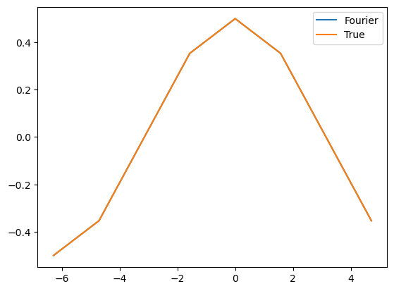
    


    Computed correctly? True


### 1D 1st derivative using rfft (warm-up)
Here, we do a dumb brute-force to master `fft`'s. Namely, we use `rfft` but use it only to mimic the above, where we use `fft`.


```python
# Work with f(x)=sin(x/2) so we can visually check whether the differentiation
# is being carried out properly. 
# The amplitude must decrease as we take higher and higher order derivatives.
NN = 2**3
LL = 4*PI
hh = LL/NN

xx_g = torch.arange(-LL/2, LL/2, hh, device=dev)
yy_g = torch.sin(0.5*xx_g)
yyp_true_g = 0.5*torch.cos(0.5*xx_g)

# Step 1. Use rfft to get only half of the DFT 
# up to Nyquist frequency
yy_g_hat = torch.fft.rfft(yy_g)

# Step 2. Multiply by eigenvalues
# construct the vector of eigenvalues 
# WARNING: rfft reduces the dimension of the vector
# and this may casue a mismatch of array sizes 

# eigenvalues are the same
Nyq = int(NN/2) # Nyquist frequency index
eig_g = torch.zeros(NN, dtype=torch.cdouble, device=dev)
eig_g[1:Nyq+1] = (1j*2*PI/LL) * torch.arange(1, Nyq+1)
eig_g[Nyq+1:] = - (1j*2*PI/LL) * torch.arange(Nyq-1, 0, -1)

# Do the usual multiplication for the first half 0 through Nyq-1
yy_g_hat_eig = torch.zeros(NN, dtype=torch.cdouble, device=dev)
yy_g_hat_eig[:Nyq] = yy_g_hat[:-1] * eig_g[:Nyq]
# For the second half, use the skew symmetry property
# 1. take the complex conjugate of DFT of positive wavenumbers
#   to get the DFT of negative wavenumbers
# 2. multiply it by eigenvalues of negative wavenumbers
#   with order flipped (here, we actually flipped DFT instead)
yy_g_hat_eig[Nyq:] = torch.conj(
    torch.flip(yy_g_hat[1:Nyq+1], dims=[0])) * eig_g[Nyq:]

# inverse FFT is full complex version
yyp_g = torch.real(torch.fft.ifft(yy_g_hat_eig))

# creat pyplot.subplots object
fig, ax = plt.subplots()

# pyplot cannot deal with torch.Tensor object, which the above two are
# So, convert them to something in the host memory '.cpu()', and then
# to numpy '.numpy()'
ax.plot(xx_g.cpu(), yyp_g.cpu(), label='Fourier')
ax.plot(xx_g.cpu(), yyp_true_g.cpu(), label='True')
plt.legend()
plt.show()

comp_correct = torch.allclose(yyp_true_g, yyp_g)
print('Computed correctly? {}'.format(comp_correct))

```


    

    


    Computed correctly? True


## **Need to be polished from here**
### 1D 1st derivative using rfft
Now, we develop a full-blown Fourier collocation method using `rfft` so that we can save memory and computation.

Since if $u$ is real valued, then so is $u'$. Therefore, we still have 
$$ \hat{u'}_{-k}= \overline{\hat{u'}_{k}}.$$
This relation can be explicitly shown:
$$\hat{u'}_{-k} = (u',\phi_{-k})= \sum_{j=-K}^K \hat u_j \lambda_j (\phi_j, {\phi_{-k}})  = \hat u_{-k} \lambda_{-k} =\overline{\hat u_{k}}\cdot \overline{\lambda_{k}}= \overline{\hat{u'}_{k}}$$
Therefore, we only need to care half of DFT: `rfft` convert to only half of the wavenumbers, and the eigenvalues for the wavenumber after the Nyquist number are taken care by complex conjugates.


```python
# Work with f(x)=sin(x/2) so we can visually check whether the differentiation
# is being carried out properly. 
# The amplitude must decrease as we take higher and higher order derivatives.
NN = 2**3
LL = 4*PI
hh = LL/NN

xx_g = torch.arange(-LL/2, LL/2, hh, device=dev)
yy_g = torch.sin(0.5*xx_g)
yyp_true_g = 0.5*torch.cos(0.5*xx_g)

# Step 1. take the function to the frequency domain
yy_g_hat = torch.fft.rfft(yy_g)

# Step 2. Multiply by eigenvalues
# construct the vector of eigenvalues 
# WARNING: rfft reduces the dimension of the vector
# and this may casue a mismatch of array sizes *** working line ***
# One solution: use Torch.size()
Nyq = int(NN/2) # Nyquist frequency index
eig_g = (1j*2*PI/LL) * torch.arange(Nyq+1, device=dev)

yy_g_hat_eig = yy_g_hat * eig_g

# We only need to work with first NN/2+1 entries in the Fourier domain
yyp_g = torch.real(torch.fft.irfft(yy_g_hat_eig)) #, norm='backward')) # yy prime = d/dx of y

# creat pyplot.subplots object
fig, ax = plt.subplots()

# pyplot cannot deal with torch.Tensor object, which the above two are
# So, convert them to something in the host memory '.cpu()', and then
# to numpy '.numpy()'

ax.plot(xx_g.cpu().numpy(), yyp_g.cpu().numpy(), label='Fourier')
ax.plot(xx_g.cpu().numpy(), yyp_true_g.cpu().numpy(), label='True')
plt.legend()
plt.show()

comp_correct = np.allclose(yyp_true_g.cpu().numpy(), yyp_g.cpu().numpy())
print('Computed correctly? {}'.format(comp_correct))
```


    

    


    Computed correctly? True


```python
yyp_g
```


    tensor([-5.0000e-01, -3.5355e-01,  2.4895e-17,  3.5355e-01,  5.0000e-01,
             3.5355e-01,  8.6127e-17, -3.5355e-01])


## 1D second derivative using Fourier interpolation differentiation


```python
# Work with f(x)=sin(x/2) so we can visually check whether the differentiation
# is being carried out properly. 
# The amplitude must decrease as we take higher and higher order derivatives.
NN = 2**8
LL = 4*PI
hh = LL/NN
xx_g = torch.arange(-LL/2, LL/2, hh, device=dev) # Do NOT use linspace for FFT stuff

yy_g = torch.sin(0.5*xx_g)
yypp_true_g = - 0.25*torch.sin(0.5*xx_g)


# Step 1. take the function to the frequency domain
yy_g_hat = torch.fft.fft(yy_g)

# Step 2. Multiply by eigenvalues
# construct the vector of eigenvalues 
# WARNING: rfft reduces the dimension of the vector
# and this may casue a mismatch of array sizes 

# # # # OPTION 3: manual coding -- good to see what's going on
# Nyq = int(NN/2)
# tmp1 = (2*PI/LL) * torch.arange(Nyq+1, device=dev) 
# # tmp1[-1] = 0
# tmp2 = - (2*PI/LL) * torch.arange(Nyq-1, 0, -1, device=dev)
# eig_g = torch.cat((tmp1, tmp2), 0)

# # # OPTION 2: use fftfreq 
# this creates frequency vector automatically, but need to study a bit more
eig_g = (2*PI/LL)*torch.fft.fftfreq(NN, 1/NN, device=dev)

# # # OPTION 1: use fftshift 
# eig_g = (2*PI/LL) * torch.arange(-NN/2, NN/2, device=dev)
# eig_g = torch.fft.fftshift(eig_g)

# second derivative
 
eig_g = eig_g * eig_g

yy_g_hat_eig = - yy_g_hat * eig_g # i^2 = -1

# inverse FFT is full complex version, not 
yypp_g = torch.real(torch.fft.ifft(yy_g_hat_eig)) # yy prime = d/dx of y

# creat pyplot.subplots object
fig, ax = plt.subplots()

# pyplot cannot deal with torch.Tensor object, which the above two are
# So, convert them to something in the host memory '.cpu()', and then
# to numpy '.numpy()'

ax.plot(xx_g.cpu().numpy(), yypp_g.cpu().numpy(), label='Fourier interpolation Derivative')
ax.plot(xx_g.cpu().numpy(), yypp_true_g.cpu().numpy(), label='True Derivative')
plt.legend()
plt.show()

comp_correct = np.allclose(yypp_true_g.cpu().numpy(), yypp_g.cpu().numpy())
print('Computed correctly? {}'.format(comp_correct))
```


    
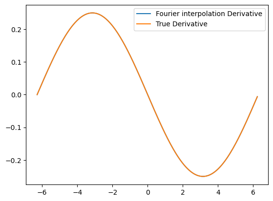
    


    Computed correctly? True


## 1D second derivative using Fourier interpolation differentiation (rfft)


```python
# Work with f(x)=sin(x/2) so we can visually check whether the differentiation
# is being carried out properly. 
# The amplitude must decrease as we take higher and higher order derivatives.
NN = 2**8
LL = 4*PI
hh = LL/NN
xx_g = torch.arange(-LL/2, LL/2, hh, device=dev) # Do NOT use linspace for FFT stuff

yy_g = torch.sin(0.5*xx_g)
yypp_true_g = - 0.25*torch.sin(0.5*xx_g)


# Step 1. take the function to the frequency domain
yy_g_hat = torch.fft.rfft(yy_g)

# Step 2. Multiply by eigenvalues
# construct the vector of eigenvalues 
# WARNING: rfft reduces the dimension of the vector
# and this may casue a mismatch of array sizes 

# # # # OPTION 3: manual coding -- good to see what's going on
# Nyq = int(NN/2)
# tmp1 = (2*PI/LL) * torch.arange(Nyq+1, device=dev) 
# # tmp1[-1] = 0
# tmp2 = - (2*PI/LL) * torch.arange(Nyq-1, 0, -1, device=dev)
# eig_g = torch.cat((tmp1, tmp2), 0)

# # # OPTION 2: use fftfreq 
# this creates frequency vector automatically, but need to study a bit more
# eig_g = (2*PI/LL)*torch.fft.fftfreq(NN, 1/NN, device=dev)
# Nyq = int(NN/2) # Nyquist frequency index
# eig_g = eig_g[:Nyq+1] # cut off after Nyquist wavenumbers

# This seems better than using fftfreq
Nyq = int(NN/2)
eig_g = (2*PI/LL) * torch.arange(Nyq+1, device=dev)


# # # OPTION 1: use fftshift 
# eig_g = (2*PI/LL) * torch.arange(-NN/2, NN/2, device=dev)
# eig_g = torch.fft.fftshift(eig_g)

# second derivative
 
eig_g = eig_g * eig_g

yy_g_hat_eig = - yy_g_hat * eig_g # i^2 = -1

# inverse FFT is full complex version, not 
yypp_g = torch.real(torch.fft.irfft(yy_g_hat_eig)) # yy prime = d/dx of y

# creat pyplot.subplots object


# pyplot cannot deal with torch.Tensor object, which the above two are
# So, convert them to something in the host memory '.cpu()', and then
# to numpy '.numpy()'

ax.plot(xx_g.cpu().numpy(), yypp_g.cpu().numpy(), label='Fourier interpolation Derivative')
ax.plot(xx_g.cpu().numpy(), yypp_true_g.cpu().numpy(), label='True Derivative')
plt.legend()
plt.show()

comp_correct = np.allclose(yypp_true_g.cpu().numpy(), yypp_g.cpu().numpy())
print('Computed correctly? {}'.format(comp_correct))
```

    No artists with labels found to put in legend.  Note that artists whose label start with an underscore are ignored when legend() is called with no argument.


    
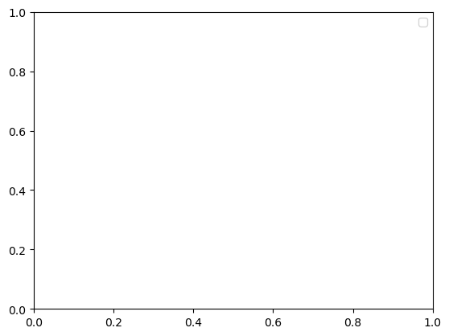
    


    Computed correctly? True


### A simple plotting tool for 2D plot
The following function is to make plotting block simple later on.


```python
def pcolor_torch(plot_in):
    # unpacking input
    if torch.is_tensor(plot_in[0]):
        # matplotlib is not compatible with PyTorch yet
        # torch.Tensor must be converted to cpu for plotting. 
        # (2022-12-24)
        xx = plot_in[0].cpu()
        yy = plot_in[1].cpu()
        uu = plot_in[2].cpu()
    else:
        xx = plot_in[0]
        yy = plot_in[1]
        uu = plot_in[2]
    
    # visualization setting
    cmap = 'jet'
    fig, ax = plt.subplots(ncols=1)
    
    uu_range = plt.pcolormesh(xx, yy, uu, cmap=cmap) 
    # name: range of uu for colorbar
    
    cbar = plt.colorbar(uu_range, ax=ax)
    cbar.minorticks_on()
    ax.set_aspect('equal')
    plt.show()
```

## 2D Laplacian
In 2-dimension, the Laplacian is defined by $\Delta=\frac{\partial^2}{\partial x^2}+\frac{\partial^2}{\partial y^2}$. In the Fourier domain, this corresponds to multiplying (discrete) Fourier expansion by $$(\frac{2\pi}{L}k\mathfrak{i})^2+(\frac{2\pi}{L}m\mathfrak{i})^2$$, where $\mathfrak{i}=\sqrt{-1}$, and $k$ and $m$ are wavenumbers of the (discrete) Fourier basis functions. 


```python
# Work with f(x)=sin(x/2) so we can visually check whether the differentiation
# is being carried out properly. 
# The amplitude must decrease as we take higher and higher order derivatives.
NN = 2**8
LL = 2*PI
hh = LL/NN
side_g = torch.arange(-LL/2, LL/2, hh, device=dev) # Do NOT use linspace for FFT stuff
# meshgrid output may look weird. It is purposely flipped.
# It does NOT work like the matrices correctly overlaps on the grid domain
# But it works so that : 1st index <--> x, 2nd index <--> y
xx_g, yy_g = torch.meshgrid(side_g, side_g, indexing='ij') 

ff_g = torch.sin(xx_g+yy_g)
lapff_true_g = - 2*ff_g # (xx_g*xx_g + yy_g*yy_g)*torch.sin(xx_g*yy_g)

# Step 1. take the function to the frequency domain
ff_hat_g = torch.fft.fftn(ff_g)

# # Step 2. Multiply by eigenvalues
# # construct the vector of eigenvalues 
# # WARNING: rfft reduces the dimension of the vector
# # and this may casue a mismatch of array sizes 

# # # # OPTION 2: use fftfreq 
# # this creates frequency vector automatically, but need to study a bit more
# eig_g = (2*PI/LL)*torch.fft.fftfreq(NN, 1/NN, device=dev)

# # OPTION 1: use fftshift 
eig_g = (2*PI/LL) * torch.arange(-NN/2, NN/2, device=dev)
eig_g = torch.fft.fftshift(eig_g)
eig_g = - eig_g * eig_g # -1 comes from i^2
lap_eig_g = eig_g + eig_g.reshape(-1, 1) # 

eig_ff_hat_g = ff_hat_g * lap_eig_g 

# # inverse FFT is full complex version, not 
# yyp_g = torch.real(torch.fft.ifft(yy_g_hat_eig)) # yy prime = d/dx of y
lapff_g = torch.real(torch.fft.ifftn(eig_ff_hat_g))

# plot

pcolor_in = [xx_g, yy_g, lapff_g - lapff_true_g]
pcolor_torch(pcolor_in)


comp_correct = torch.allclose(lapff_g, lapff_true_g) #)
print('Computed correctly? {}'.format(comp_correct))
```


    
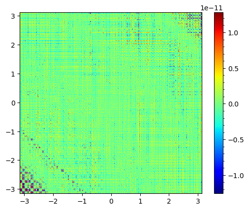
    


    Computed correctly? True


## 2D Laplacian (rfftn version)
As in 1D, FFT of a real-valued function bears a symmetry. Thus, `rfftn` stores half of the information compared to `fftn`. However, the symmetry is not quite diagonal.

First, see the symmetry.
$$\hat{u}_{-\mathbf{k}} 
= (u(\mathbf{x}), e^{-\mathfrak{i}\mathbf{k} \cdot\mathbf{x}} ) 
= ( \overline{u(\mathbf{x})}, \overline{e^{\mathfrak{i}\mathbf{k} \cdot\mathbf{x}}} ) 
= \overline{( u(\mathbf{x}), e^{\mathfrak{i}\mathbf{k} \cdot\mathbf{x}} ) }
= \overline{\hat{u}_{-\mathbf{k}}}
$$

Then, see the table of wavenumber pairs ($\mathbf{k}$ above), where $NN=5$ or $KK=(NN-1)/2=2$. Boldface indicates the essential ones.

| | | | | |
|:--:|:--:|:--:|:--:|:--:|
| **-2,-2** | **-2,-1** | **-2,0** | -2,1 | -2,2 |
| **-1,-2** | **-1,-1** | **-1,0** | -1,1 | -1,2 |
| **0,-2** | **0,-1** | **0,0** | 0,1 | 0,2 |
| **1,-2** | **1,-1** | 1,0 | 1,1 | 1,2 |
| **2,-2** | **2,-1** | 2,0 | 2,1 | 2,2 |

For this reason, `rfftn` stores only the half of the last dimension (last index).


```python
# Work with f(x)=sin(x/2) so we can visually check whether the differentiation
# is being carried out properly. 
# The amplitude must decrease as we take higher and higher order derivatives.
NN = 2**8
LL = 2*PI
hh = LL/NN
side_g = torch.arange(-LL/2, LL/2, hh, device=dev) # Do NOT use linspace for FFT stuff
# meshgrid output may look weird. It is purposely flipped.
# It does NOT work like the matrices correctly overlaps on the grid domain
# But it works so that : 1st index <--> x, 2nd index <--> y
xx_g, yy_g = torch.meshgrid(side_g, side_g, indexing='ij') 

ff_g = torch.sin(xx_g+yy_g)
lapff_true_g = - 2*ff_g # (xx_g*xx_g + yy_g*yy_g)*torch.sin(xx_g*yy_g)

# Step 1. take the function to the frequency domain
ff_hat_g = torch.fft.rfftn(ff_g)

# # Step 2. Multiply by eigenvalues
# # construct the vector of eigenvalues 
# # WARNING: rfft reduces the dimension of the vector
# # and this may casue a mismatch of array sizes 

# # # # OPTION 2: use fftfreq 
# # this creates frequency vector automatically, but need to study a bit more
# eig_g = (2*PI/LL)*torch.fft.fftfreq(NN, 1/NN, device=dev)

# # OPTION 1: use fftshift 
eig_g = (2*PI/LL) * torch.arange(-NN/2, NN/2, device=dev)
eig_g = torch.fft.fftshift(eig_g)
eig_g = - eig_g * eig_g # -1 comes from i^2

Nyq = int(NN/2) # Nyquist frequency index
lap_eig_g = eig_g[:Nyq+1] + eig_g.reshape(-1, 1) # 

eig_ff_hat_g = ff_hat_g * lap_eig_g 

# # inverse FFT is full complex version, not 
# yyp_g = torch.real(torch.fft.ifft(yy_g_hat_eig)) # yy prime = d/dx of y
lapff_g = torch.real(torch.fft.irfftn(eig_ff_hat_g))

# plot

pcolor_in = [xx_g, yy_g, lapff_g - lapff_true_g]
pcolor_torch(pcolor_in)


comp_correct = torch.allclose(lapff_g, lapff_true_g) #)
print('Computed correctly? {}'.format(comp_correct))
```


    
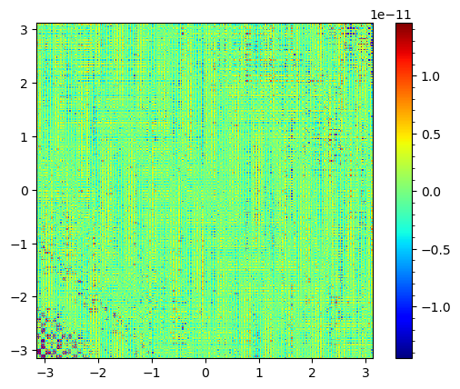
    


    Computed correctly? True


## Mobility dependent 2D Laplacian
Now, for a given mobility function, $M:\Omega\to\mathbb{R}$, we want to compute $M$--Laplacian $$\Delta_M:=\nabla\cdot(M(u)\nabla u)$$, where $\Omega\subset\mathbb{R}^2$ is a retangular domain. Unless somebody comes up with a groundbreaking idea, we need twice as much computations as before since we need to compute the gradient and the divergence operator separately.

### Sanity check
For the sanity check, set:
| $M(x,y)$ | $u(x,y)$ | $\Delta_M u(x,y)$ |
| :------: | :------: | :---------------: |
| $\cos(x+y)$ | $\sin(x+y)$ | $-4\cos(x+y)\sin(x+y)$ |

### Preliminary Calculations
$$ \nabla u(x,y) = \begin{bmatrix} \partial_x u \\ \partial_y u \end{bmatrix}, $$
where
$ \partial_x u(x,y) $ is computed `real(ifftn( 1j * eig_x * fftn(uu))))`, where `torch.` is omitted.

### Notes
Thanks to broadcasting, we don't need to store `eig_x` and `eig_y` separately, nor as a full matrix. Simply, multiply DFT of the target by `eig.reshape((-1, 1))` (a column) for $\partial_x$. This is related to how `meshgrid` works. Since the first component corresponds to $x$--axis, the Fourier eigenvalues of $\partial_x$ must vary as it sweeps each column (i.e., as row index sweeps).

### asymmetric problem
For the sanity check, set:
| $M(x,y)$ | $u(x,y)$ | $\Delta_M u(x,y)$ |
| :------: | :------: | :---------------: |
| $\cos(x)$ | $\sin(x-y)$ | $-\sin(x)\cos(x-y)$ |

**Variable Naming**
From now on, we omit `_g` for variables stored on GPU. We just normally work on GPU and converit only when plot something.


```python
def pder(uu, var_ind, eig):
    if var_ind == 1: # dervative wrt first component
        eig = eig.reshape((-1, 1))
    elif var_ind == 2: # dervative wrt second component
        eig = eig.reshape((1, -1))
    return torch.real(torch.fft.ifftn(torch.fft.fftn(uu) * eig * 1j))
```


```python
NN = 2**9
LL = 2*PI
hh = LL/NN
side = torch.arange(-LL/2, LL/2, hh, device=dev) # Do NOT use linspace for FFT stuff
# meshgrid output may look weird. It is purposely flipped.
# It does NOT work like the matrices correctly overlaps on the grid domain
# But it works so that : 1st index <--> x, 2nd index <--> y
xx, yy = torch.meshgrid(side, side, indexing='ij') 

# # problem setting
# Mobfn = lambda x,y: torch.cos(x+y)
# uu = torch.sin(xx+yy)
# MM = Mobfn(xx,yy)
# Mlapuu_true = -4*uu*MM

# problem that is not symmetric wrt (x,y)
Mobfn = lambda xx,yy: torch.cos(xx)
uu = torch.sin(xx-yy)
MM = Mobfn(xx,yy)
Mlapuu_true = -torch.cos(xx-yy)*torch.sin(xx)-2*torch.sin(xx-yy)*torch.cos(xx)


# Step 1. take the function to the frequency domain


# # Step 2. Multiply by eigenvalues
# # construct the vector of eigenvalues 
# # WARNING: rfft reduces the dimension of the vector
# # and this may casue a mismatch of array sizes 

# # # OPTION 2: use fftfreq 
# this creates frequency vector automatically, but need to study a bit more
eig = (2*PI/LL)*torch.fft.fftfreq(NN, 1/NN, device=dev)

# # # OPTION 1: use fftshift 
# eig = (2*PI/LL) * torch.arange(-NN/2, NN/2, device=dev)
# eig = torch.fft.fftshift(eig)


# Find M-gradient (M(x,y)*\nabla u(x,y))
Mgrad1 = MM * pder(uu, 1, eig)
Mgrad2 = MM * pder(uu, 2, eig)

# Take divergence
Mlapuu = pder(Mgrad1, 1, eig) + pder(Mgrad2, 2, eig)

# plot
err = Mlapuu - Mlapuu_true
pcolor_in = [xx, yy, err]
pcolor_torch(pcolor_in)


comp_correct = torch.allclose(Mlapuu, Mlapuu_true)
print('Computed correctly? {}'.format(comp_correct))
```


    
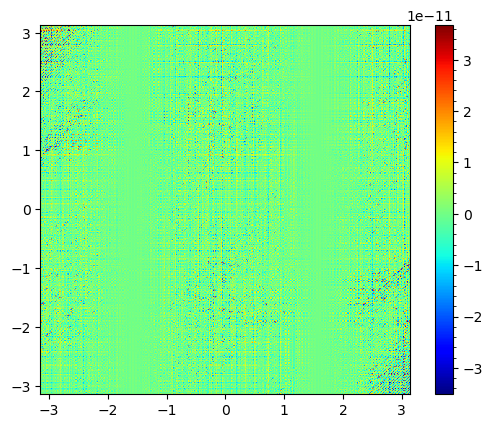
    


    Computed correctly? True


## Mobility dependent 2D Laplacian (rfft version)
This can be quite confusing. 
First, recall that $\partial_x$ is associated to the 1st index (wavenumber) in the Fourier domain, and $\partial_y$ to the 2nd.
$$\hat{\partial_x u}_{\mathbf{k}}
= (\partial_x u, \phi_{\mathbf{k}}) 
= (\sum_{\mathbf{n}} \mathfrak{i}n_1 \hat{u}_{\mathbf{n}} \phi_{\mathbf{n}}, \phi_{\mathbf{k}})
= \sum_{\mathbf{n}} \mathfrak{i}n_1 \hat{u}_{\mathbf{n}} (\phi_{\mathbf{n}}, \phi_{\mathbf{k}})
= \mathfrak{i}k_1 \hat{u}_{\mathbf{k}}
$$

Also, we still have a symmetry as in plain $\hat u$'s.
$$\hat{\partial_x u}_{-\mathbf{k}}
= -\mathfrak{i}k_1 \hat{u}_{-\mathbf{k}}
= \overline{\mathfrak{i}k_1} \overline{\hat{u}_{\mathbf{k}}}
= \overline{\mathfrak{i}k_1 \hat{u}_{\mathbf{k}}}
= \overline{ \hat{\partial_x u}_{\mathbf{k}} }
$$

Recall that only half of the last dimension are stored when using `rfftn` (boldface below). Now, for $\partial_x$, we need to multiply eigenvalues $\mathfrak{i}k_1$ for all entries with the same first index (wavenumber). This is a realization of $\mathfrak{i}k_1 \hat{u}_{k_1, k_2}$ above. ($NN=5$ is assumed)

| | | | | |
|:--:|:--:|:--:|:--:|:--:|
| **-2,-2** | **-2,-1** | **-2,0** | -2,1 | -2,2 |
| **-1,-2** | **-1,-1** | **-1,0** | -1,1 | -1,2 |
| **0,-2** | **0,-1** | **0,0** | 0,1 | 0,2 |
| **1,-2** | **1,-1** | 1,0 | 1,1 | 1,2 |
| **2,-2** | **2,-1** | 2,0 | 2,1 | 2,2 |

Since each row has the same first index, we do this by creating a `torch.Tensor`:

| | | |
|:--:|:--:|:--:|
| $-2\mathfrak{i}$ | $-2\mathfrak{i}$ | $-2\mathfrak{i}$ |
| $-1\mathfrak{i}$ | $-1\mathfrak{i}$ | $-1\mathfrak{i}$ |
| $0$ | $0$ | $0$ |
| $1\mathfrak{i}$ | $1\mathfrak{i}$ | $1\mathfrak{i}$ |
| $2\mathfrak{i}$ | $2\mathfrak{i}$ | $2\mathfrak{i}$ |

In contrast, for $\partial_y$, we have to match the 2nd index. Hence, we create

| | | |
|:--:|:--:|:--:|
| $-2\mathfrak{i}$ | $-1\mathfrak{i}$ | $0$ |
| $-2\mathfrak{i}$ | $-1\mathfrak{i}$ | $0$ |
| $-2\mathfrak{i}$ | $-1\mathfrak{i}$ | $0$ |
| $-2\mathfrak{i}$ | $-1\mathfrak{i}$ | $0$ |
| $-2\mathfrak{i}$ | $-1\mathfrak{i}$ | $0$ |

The above discussion is not quite right. Since most `fft` libraries start wavenumber 0, not $-K$, everything must be shifted. Though there can be many different ways to collect essential Fourier coefficients, according to documentation of PyTorch (it says the last dimension is half), the option 2 below seems to be adopted: (wavenumber 3 alias with $3 - NN = -2$ and 4 alias with $4 - NN = -1$)

Option 1

| | | | | |
|:--:|:--:|:--:|:--:|:--:|
| **0,0** | **0,1** | **0,2** | 0,3 = 0,-2| 0,4 = 0,-1 |
| **1,0** | **1,1** | **1,2** | **1,3 = 1,-2**| **1,4 = 1,-1**|
| **2,0** | **2,1** | **2,2** | **2,3 = 2,-2**| **2,4 = 2,-1**|
| 3,0 = -2,0 | 3,1 = -2,1 | 3,2 = -2,2 | 3,3 = -2,-2| 3,4 = -2,-1|
| 4,0 = -1,0 | 4,1 = -1,1 | 4,2 = -1,2 | 4,3 = -1,-2| 4,4 = -1,-1|


Option 2

| | | | | |
|:--:|:--:|:--:|:--:|:--:|
| **0,0** | **0,1** | **0,2** | 0,3 = 0,-2| 0,4 = 0,-1 |
| **1,0** | **1,1** | **1,2** | 1,3 = 1,-2| 1,4 = 1,-1|
| **2,0** | **2,1** | **2,2** | 2,3 = 2,-2| 2,4 = 2,-1|
| 3,0 = -2,0 | **3,1 = -2,1** | **3,2 = -2,2** | 3,3 = -2,-2| 3,4 = -2,-1|
| 4,0 = -1,0 | **4,1 = -1,1** | **4,2 = -1,2** | 4,3 = -1,-2| 4,4 = -1,-1|


Therefore, the eigenvalues of $\partial_x$ must be:

| | | |
|:--:|:--:|:--:|
| $0$ | $0$ | $0$ |
| $1\mathfrak{i}$ | $1\mathfrak{i}$ | $1\mathfrak{i}$ |
| $2\mathfrak{i}$ | $2\mathfrak{i}$ | $2\mathfrak{i}$ |
| $-2\mathfrak{i}$ | $-2\mathfrak{i}$ | $-2\mathfrak{i}$ |
| $-1\mathfrak{i}$ | $-1\mathfrak{i}$ | $-1\mathfrak{i}$ |


Similarly, the eigenvalues of $\partial_y$ must be:

| | | |
|:--:|:--:|:--:|
| $0$ | $1\mathfrak{i}$ | $2\mathfrak{i}$ |
| $0$ | $1\mathfrak{i}$ | $2\mathfrak{i}$ |
| $0$ | $1\mathfrak{i}$ | $2\mathfrak{i}$ |
| $0$ | $1\mathfrak{i}$ | $2\mathfrak{i}$ |
| $0$ | $1\mathfrak{i}$ | $2\mathfrak{i}$ |

Why do no negative wavenumbers in $\partial_y$ appear? Though I didn't experiment it, I believe that is taken care of when apply `irfftn`: while take the complex conjugate, negative wavenumbers will naturally appear in computation.


```python
def pderr(uu, var_ind, eig):
    ''' 
    eig is of a half the size (Nyq + 1 to be precise)
    '''
    Nyq = int(uu.size()[0]/2)  # compute Nyquist frequency
    if var_ind == 1: # dervative wrt first component
        # construct full 1D eigenvalues 
        eig_flip = torch.flip(eig[1:-1], dims=[0]) 
        eig = torch.cat((eig, -eig_flip), -1)

        # construct eigenvalue matrix of half size
        tmp = torch.zeros((1,Nyq + 1), device=dev) # only for broadcasting
        eig_ = eig.reshape((-1, 1)) + tmp

    elif var_ind == 2: # dervative wrt second component
        # construct eigenvalue matrix of half size
        # -- no need for the full 1D eigenvalues as opposed to D_x
        tmp = torch.zeros((NN,1), device=dev) # only for broad casting
        eig_ = eig.reshape((1, -1)) + tmp
    
    return torch.real(torch.fft.irfftn(torch.fft.rfftn(uu) * eig_ * 1j))
```


```python

NN = 2**8
LL = 2*PI
hh = LL/NN
side = torch.arange(-LL/2, LL/2, hh, device=dev) # Do NOT use linspace for FFT stuff
# meshgrid output may look weird. It is purposely flipped.
# It does NOT work like the matrices correctly overlaps on the grid domain
# But it works so that : 1st index <--> x, 2nd index <--> y
xx, yy = torch.meshgrid(side, side, indexing='ij') 

# # problem setting
# Mobfn = lambda x,y: torch.cos(x+y)
# uu = torch.sin(xx+yy)
# MM = Mobfn(xx,yy)
# Mlapuu_true = -4*uu*MM

# problem that is not symmetric wrt (x,y)
Mobfn = lambda xx,yy: torch.cos(xx)
uu = torch.sin(xx-yy)
MM = Mobfn(xx,yy)
Mlapuu_true = -torch.cos(xx-yy)*torch.sin(xx)-2*torch.sin(xx-yy)*torch.cos(xx)


# Step 1. take the function to the frequency domain


# # Step 2. Multiply by eigenvalues
# # construct the vector of eigenvalues 
# # WARNING: rfft reduces the dimension of the vector
# # and this may casue a mismatch of array sizes 

# # # OPTION 2: use fftfreq 
# this creates frequency vector automatically, but need to study a bit more
# eig = (2*PI/LL)*torch.fft.fftfreq(NN, 1/NN, device=dev)

# # # OPTION 1: use fftshift 
Nyq = int(NN/2) # Nyquist frequency index
eig = (2*PI/LL) * torch.arange(Nyq+1, device=dev)


# Find M-gradient (M(x,y)*\nabla u(x,y))
Mgrad1 = MM * pderr(uu, 1, eig)
Mgrad2 = MM * pderr(uu, 2, eig)

# Take divergence
Mlapuu = pderr(Mgrad1, 1, eig) + pderr(Mgrad2, 2, eig)

# plot
err = Mlapuu - Mlapuu_true
pcolor_in = [xx, yy, err]
pcolor_torch(pcolor_in)


comp_correct = torch.allclose(Mlapuu, Mlapuu_true)
print('Computed correctly? {}'.format(comp_correct))
```


    
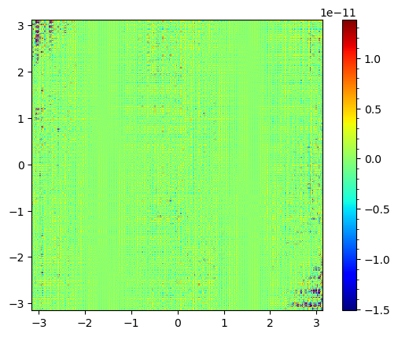
    


    Computed correctly? True


## Inverting Laplacian

### Sanity check
For the sanity check, set:
| $u(x,y)$ | $\Delta u(x,y)$ |
| :------: | :---------------: |
| $\sin(2x-y)$ | $-5\sin(2x-y)$ |

### Preliminary Calculations
Inverse Laplacian is properly defined only for mean-zero function. 
$$ \int_\Omega \Delta u \cdot 1 dx = -\int_\Omega \nabla u \cdot \nabla 1 dx =0.$$

In 2-dimension, the inverse Laplacian $u$ of $f$ is defined by $\Delta u = f$. In the Fourier domain, this corresponds to dividing (discrete) Fourier expansion of $f$ by $$(\frac{2\pi}{L}k\mathfrak{i})^2+(\frac{2\pi}{L}m\mathfrak{i})^2$$, where $\mathfrak{i}=\sqrt{-1}$, and $k$ and $m$ are wavenumbers of the (discrete) Fourier basis functions. This is thanks to the orthogonality property of the (discrete) Fourier basis. That is, from
$$ u(\mathbf{x}) = \sum_{\mathbf{k}} \hat u_\mathbf{k} \phi_\mathbf{k} $$ 
$$ \Delta u(\mathbf{x}) = \sum_{\mathbf{k}} \hat u_\mathbf{k} \left|\frac{2\pi}{L}\mathfrak{i}\mathbf{k}\right|^2_{\mathbb{R}^2} \phi_\mathbf{k}  = \sum_{\mathbf{k}} \hat f_\mathbf{k} \phi_\mathbf{k} =f(\mathbf{x}), $$ 

take the inner product on both sides to see
$$ (\Delta u(\mathbf{x}),\phi_\mathbf{m}) = \hat u_\mathbf{m} \left|\frac{2\pi}{L}\mathfrak{i}\mathbf{m}\right|^2_{\mathbb{R}^2} = \hat f_\mathbf{m}.$$ 

Thus, if $\mathbf{m}\neq(0,0)$, we simply divide through by $\left|\frac{2\pi}{L}\mathfrak{i}\mathbf{m}\right|^2_{\mathbb{R}^2}$ to get $u_\mathbf{m}$ (Fourier coefficients of the inverse Laplacian of $f$). If $\mathbf{m}=(0,0)$, we require $u_\mathbf{m}=0$ for the sake of uniqueness of the inverse Laplacian. But since $f_\mathbf{m}=0$, dividing by any nonzero number, say 1, does the job. And that's why we replace the zero eigenvalue by 1. 

$ \Delta^{-1} f(x,y) $ is computed `real(ifftn( fftn(ff) / lap1_eig )))`, where `torch.` is omitted and `lap1_eig` is the eigenvalues matrix of the Laplacian with (0,0) entry replaced by 1 to avoid dividing by 0.


**Variable Naming**
From now on, we omit `_g` for variables stored on GPU. We just normally work on GPU and converit only when plot something.


```python
# Work with f(x)=sin(x/2) so we can visually check whether the differentiation
# is being carried out properly. 
# The amplitude must decrease as we take higher and higher order derivatives.
NN = 2**8
LL = 2*PI
hh = LL/NN
side = torch.arange(-LL/2, LL/2, hh, device=dev) # Do NOT use linspace for FFT stuff
# meshgrid output may look weird. It is purposely flipped.
# It does NOT work like the matrices correctly overlaps on the grid domain
# But it works so that : 1st index <--> x, 2nd index <--> y
xx, yy = torch.meshgrid(side, side, indexing='ij') 

ilapff_true = torch.sin(2*xx - yy)
ff = - 5*ilapff_true 

# Step 1. take the function to the frequency domain
ff_hat = torch.fft.fftn(ff)

# # Step 2. Multiply by eigenvalues
# # construct the vector of eigenvalues 
# # WARNING: rfft reduces the dimension of the vector
# # and this may casue a mismatch of array sizes 

# # # # OPTION 2: use fftfreq 
# # this creates frequency vector automatically, but need to study a bit more
# eig = (2*PI/LL)*torch.fft.fftfreq(NN, 1/NN, device=dev)

# # OPTION 1: use fftshift 
eig = (2*PI/LL) * torch.arange(-NN/2, NN/2, device=dev)
eig = torch.fft.fftshift(eig)
eig = - eig * eig # -1 comes from i^2
lap1_eig = eig + eig.reshape(-1, 1)
lap1_eig[lap1_eig == 0] = 1

# # inverse FFT is full complex version, not 
# yyp = torch.real(torch.fft.ifft(yy_hat_eig)) # yy prime = d/dx of y
ilapff = torch.real(torch.fft.ifftn(ff_hat/lap1_eig))

# plot

pcolor_in = [xx, yy, ilapff - ilapff_true]
pcolor_torch(pcolor_in)


comp_correct = torch.allclose(ilapff, ilapff_true) #)
print('Computed correctly? {}'.format(comp_correct))
```


    
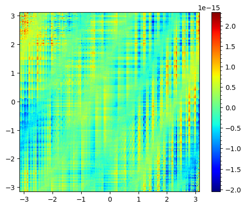
    


    Computed correctly? True


## Inverting Laplacian (rfft version)

The only difference from `rfftn` version of 2D Laplacian is that we divide by the eigenvalue rather than multiply. 

Also, we need to replace 0 eigenvalue by 1 for the same reason as in inverse Laplacian case (plain `fftn` version).


```python
# Work with f(x)=sin(x/2) so we can visually check whether the differentiation
# is being carried out properly. 
# The amplitude must decrease as we take higher and higher order derivatives.
NN = 2**8
LL = 2*PI
hh = LL/NN
side = torch.arange(-LL/2, LL/2, hh, device=dev) # Do NOT use linspace for FFT stuff
# meshgrid output may look weird. It is purposely flipped.
# It does NOT work like the matrices correctly overlaps on the grid domain
# But it works so that : 1st index <--> x, 2nd index <--> y
xx, yy = torch.meshgrid(side, side, indexing='ij') 

ilapff_true = torch.sin(2*xx - yy)
ff = - 5*ilapff_true 

# Step 1. take the function to the frequency domain
ff_hat = torch.fft.rfftn(ff)

# # Step 2. Multiply by eigenvalues
# # construct the vector of eigenvalues 
# # WARNING: rfft reduces the dimension of the vector
# # and this may casue a mismatch of array sizes 

# # # # OPTION 2: use fftfreq 
# # this creates frequency vector automatically, but need to study a bit more
# eig = (2*PI/LL)*torch.fft.fftfreq(NN, 1/NN, device=dev)

# # OPTION 1: use fftshift 
eig = (2*PI/LL) * torch.arange(-NN/2, NN/2, device=dev)
eig = torch.fft.fftshift(eig)
eig = - eig * eig # -1 comes from i^2

Nyq = int(NN/2) # Nyquist frequency index
lap1_eig = eig[:Nyq+1] + eig.reshape(-1, 1) # 

lap1_eig[lap1_eig == 0] = 1

# # inverse FFT is full complex version, not 
# yyp = torch.real(torch.fft.ifft(yy_hat_eig)) # yy prime = d/dx of y
ilapff = torch.real(torch.fft.irfftn(ff_hat/lap1_eig))

# plot

pcolor_in = [xx, yy, ilapff - ilapff_true]
pcolor_torch(pcolor_in)


comp_correct = torch.allclose(ilapff, ilapff_true) #)
print('Computed correctly? {}'.format(comp_correct))
```


    
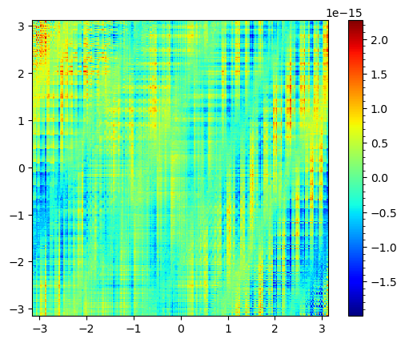
    


    Computed correctly? True


### Keep track of big errors
$$\nabla u = \begin{bmatrix}\cos(x-y)\\ - \cos(x-y)\end{bmatrix}$$
$$ M\nabla u = \begin{bmatrix}\cos(x)\cos(x-y)\\ - \cos(x)\cos(x-y)\end{bmatrix}$$
$$ \begin{bmatrix}\partial_x(M\partial_x u)\\ \partial_y(M\partial_y u)\end{bmatrix} 
= \begin{bmatrix}-\sin(x)\cos(x-y)-\cos(x)\sin(x-y)\\ -\cos(x)\sin(x-y)\end{bmatrix}$$


```python
# test partial derivatives

eig = (2*PI/LL) * torch.arange(-NN/2, NN/2, device=dev)
eig = torch.fft.fftshift(eig)

vv = torch.cos(xx-yy)*torch.cos(xx)
cur_true = -torch.cos(xx-yy)*torch.sin(xx)-torch.sin(xx-yy)*torch.cos(xx)
# vv = -torch.cos(xx-yy)*torch.cos(xx)
# cur_true = -torch.sin(xx-yy)*torch.cos(xx)

cur = pder(vv, 1, eig)
err = cur - cur_true
pcolor_in = [xx, yy, err]
pcolor_torch(pcolor_in)
```


    
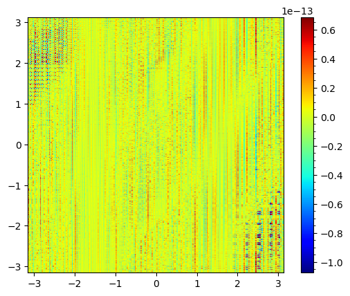
    


```python
# test partial derivatives (rfft version)
Nyq = int(NN/2)
eig = (2*PI/LL) * torch.arange(Nyq + 1, device=dev)

# Test for partial_x
# vv = torch.cos(xx-yy)*torch.cos(xx)
# cur_true = -torch.cos(xx-yy)*torch.sin(xx)-torch.sin(xx-yy)*torch.cos(xx)

# Test for partial_y
vv = -torch.cos(xx-yy)*torch.cos(xx)
cur_true = -torch.sin(xx-yy)*torch.cos(xx)

cur = pderr(vv, 2, eig)
err = cur - cur_true
pcolor_in = [xx, yy, err]
pcolor_torch(pcolor_in)
```


    
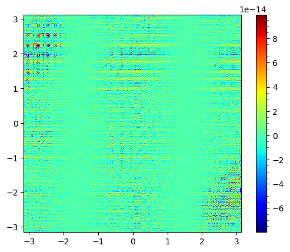
    


