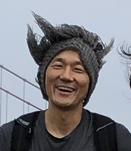

## About

| | | |
|:-:|:-|:-|
| {width=150px} | I am a Visiting Assistant Professor of the [Mathematics Departement at the University of California, Santa Barbara](https://www.math.ucsb.edu/). I finished my Ph.D. in Mathematics (computational and applied mathematics) at the [Mathematics Department at the University of Tennessee at Knoxville](https://www.math.utk.edu) under the supervision of [Dr. Steven Wise](http://www.math.utk.edu/~swise) and [Dr. Abner Salgado](http://www.math.utk.edu/~abnersg/).    Here is my **[CV](resources/documents/modernCV.pdf)**. | **Address**:   Department of Mathematics   South Hall, Room 6607   University of California   Santa Barbara, CA 93106-3080    **Email**: jhpark1\@ucsb.edu   **Office**: South Hall 6524 s| 

## Current classes

<!--[Math 104A (Fall 2023)](teaching/M104A2023Fall.html) -->

| | |
|:-|:-|
|Math 104A (Fall 2023) [Notes (Github)](https://github.com/jhparkyb/NumAnalNotes_Pub) | **Office hours** (Fall 2023)   M: 3:30-4:40 PM (SH 4519)   T: 2:00-3:00 PM (SH 4519)   W: 4:00-5:00 PM (SH 4607)   R: 8:00-9:00 AM (SH 6617)   **Friendship hours** (Fall 2023)   F: 4:00-5:00 PM (SH 6524) |

<!-- [ Math 6A (Winter 2023)](./M6A_2023Winter.html)

[ Math 8 (Winter 2023)](./M8_2023Winter.html)

[ Math 104A (Fall 2022)](./M104A_2022Fall.html) -->
