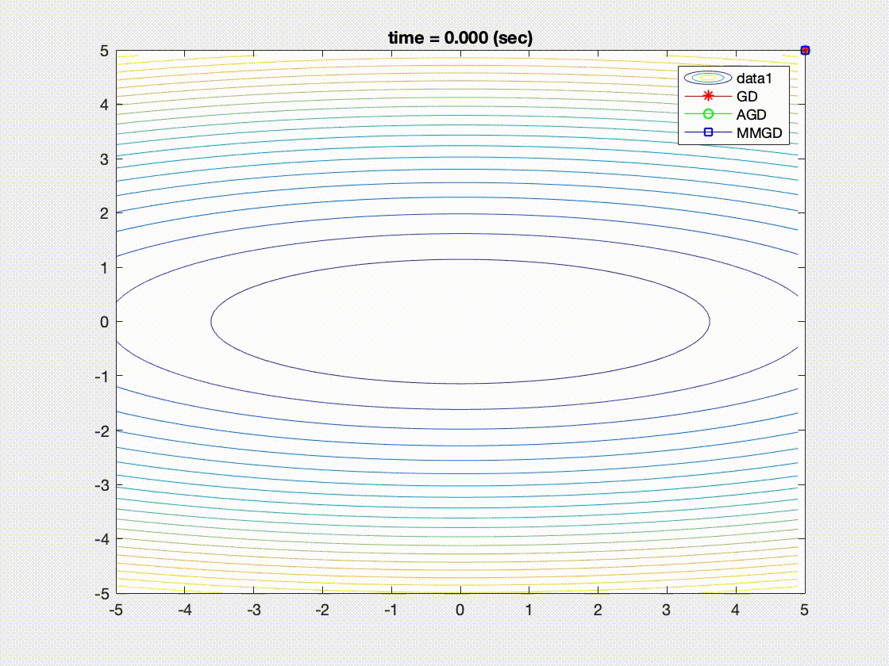
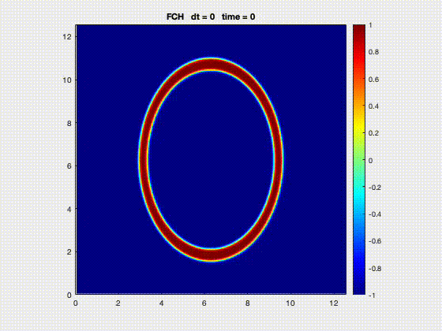
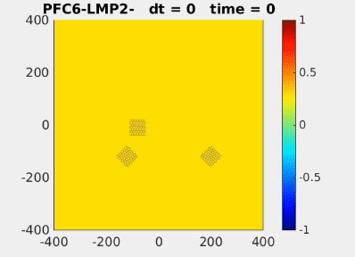

```{r setup, include=FALSE}
knitr::opts_chunk$set(echo = TRUE)
```


## Optimization and its applications to numerical PDEs

I study how Nesterov acceleration can be explained using a simply, physical intuition and use it to solve a nonlinear, nonlocal PDEs. 


{width=70%}

### Related publications

1. Park, J.-H., Salgado, A. J., & Wise, S. M. (2021). Preconditioned accelerated gradient descent methods for locally Lipschitz smooth objectives with applications to the solution of nonlinear PDEs. J. Sci. Comput., 89(1), Paper No. 17, 37. https://doi.org/10.1007/s10915-021-01615-8

## Computational study of real world problems

I study efficient computational simulation of important models from physics and materials science. 


{width=45%} {width=45%} 

### Related publications

2. Park, J.-H., Salgado, A. J., \& Wise, S. M. (2023). *Benchmark computations of the phase field crystal and functionalized Cahn-Hilliard equations via fully implicit, Nesterov accelerated schemes*. Communications in Computational Physics, 33(2), 367–398. https://doi.org/10.4208/cicp.OA-2022-0117

3. (In progress) Park, J.-H., Salgado, A. J., \& Wise, S. M. *Perturbed preconditioned gradient descent method for Cahn-Hilliard equation with variable mobility*.

## Theoretical numerical analysis

I study theoretical foundations basis on which we can derive desirable properties of numerical methods

### Related publications

4. (in progress) Park, J.-H., Salgado, A. J., \& Wise, S. M. *Nondegenerate convergence of generic local Lipschitz smooth functionals beyond Sobolev embedding*.

